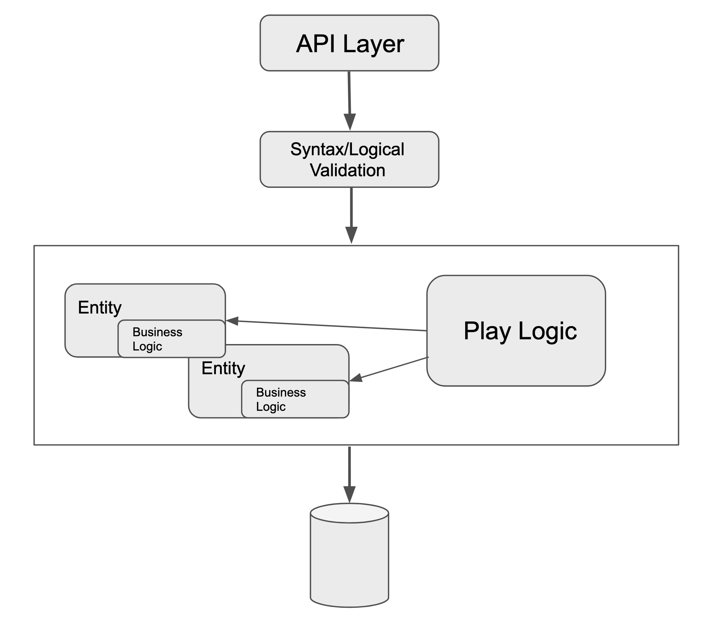

## ProQuiz v0.1 (old)

I started this project with the idea to create a simple quiz to use during technical interviews. Nothing new on the horizon. Something I would quickly develop in my free time and later propose to my company.

Considering I am not very skilled with the new Front-End frameworks/libraries, to speed up the development and I have opted for a Model-View-Template framework.

I quickly realised that this idea would have not be suitable for the context so I decided to make a U turn and develop something a bit different.

When I started working on the quiz I opted for [Pyramid](https://docs.pylonsproject.org/projects/pyramid/en/latest/) because I wanted to learn this framework.

This repository contains the first complete version. Although Pyramid is more a Model-View-Template framework, I developed my solution using a standard REST CRUD approach.

A set of endpoints mapped to a set of entities (aka `models`) with a simple validation mechanism in between, plus the _play_ logic.

This project was then ported to the [new version](https://github.com/mp-83/proquiz), that uses FastAPI.
